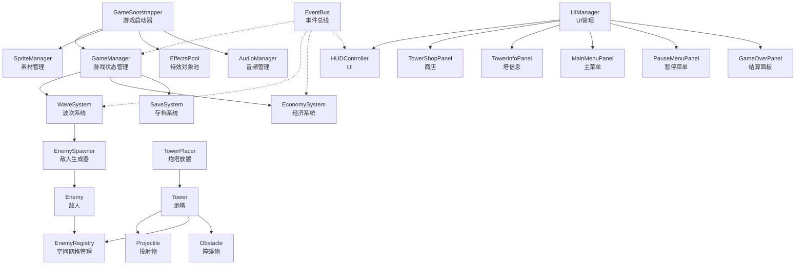

# 塔防大作战

一款基于 Unity 2022.3 开发的 2D 塔防游戏。

## 游戏演示

[](https://aka.doubaocdn.com/s/dLHYkqQmPR)

> 点击上方图片观看完整游戏演示视频

## 游戏截图

### 主界面


### 关卡选择


### 第一关


### 第二关


### 第三关


### 第四关


### 第五关


## 游戏特色

### 6种炮塔
- **箭塔**：攻速快的单体物理攻击，造价低廉，早期核心
- **炮塔**：范围溅射伤害，攻速慢但威力大，对付成群敌人
- **冰塔**：减速敌人40%持续2秒，辅助控制
- **激光塔**：持续光束攻击，DPS极高，自动锁定目标
- **毒塔**：发射毒液，命中后使敌人中毒，持续3秒每秒造成伤害
- **辅助塔**：不直接攻击，为范围内所有炮塔提供25%攻速和20%伤害加成

### 5个关卡
| 关卡 | 主题 | 波次 | 路径特点 |
|---|---|---|---|
| 第1关 | 草原 | 10波 | 经典S形路径 |
| 第2关 | 沙漠 | 15波 | 曲折之字路 |
| 第3关 | 冰雪 | 20波 | 环形包围战 |
| 第4关 | 火山 | 22波 | 迂回多弯 |
| 第5关 | 森林 | 25波 | 迷宫路径 |

每关独立地图配色和主题障碍物（树/仙人掌/冰晶/熔岩岩/蘑菇等）。

### 障碍物系统
- 8种障碍物，可被鼠标左键选中（全局唯一选中）
- 选中后炮塔优先攻击障碍物，投射物和激光均生效
- 摧毁障碍物获得金币奖励（按血量计算）
- 障碍物上不可放置炮塔

### 多种敌人
- 普通、快速、坦克、Boss、精英五种类型
- 含飞行和隐身单位
- 每关敌人配色差异化，朝向自动旋转

## 操作说明

| 操作 | 功能 |
|---|---|
| 左键点击商店炮塔 | 进入放置模式，再点地图放置 |
| 左键点击已放置炮塔 | 查看信息、升级、出售 |
| 左键点击障碍物 | 选中障碍物，炮塔优先攻击 |
| 右键 / ESC | 取消放置 / 取消选中 |
| 倍速按钮 | 切换1x/2x/3x游戏速度 |
| 菜单按钮 | 暂停游戏 |

## 技术架构

### 系统架构图



### 核心技术点

#### 1. 性能优化：空间网格分桶
**问题**：传统塔防每帧每塔遍历全部敌人找目标，复杂度 O(塔数 × 敌人数)，敌人多时严重掉帧。

**方案**：EnemyRegistry 使用空间网格分桶，将地图划分为固定大小的格子，敌人按位置登记到对应桶中。塔查询范围内敌人时只需检查相邻几个桶。

**效果**：目标查找从 O(n) 降为 O(1) 平均复杂度，100+ 敌人仍稳定 60FPS。

#### 2. 对象池
**问题**：频繁 Instantiate/Destroy 特效和子弹导致 GC 卡顿。

**方案**：EffectsPool 管理死亡爆炸、炮口闪光、命中特效的对象池，取用和归还替代销毁。

#### 3. 事件总线
**方案**：EventBus 静态泛型事件系统，各模块通过事件解耦。支持异常捕获，单个订阅者报错不影响其他订阅者。

#### 4. 程序化生成
- **TowerVisualFactory**：6种炮塔128×128精灵程序化生成（八边形渐变基座+独特造型）
- **ProjectileVisualFactory**：6种子弹精灵
- **EffectsPool**：死亡多层爆炸、炮口星形、命中双层环
- 无需外部素材依赖，开箱即跑

#### 5. 音频系统
- AudioManager 程序化生成 BGM（C大调循环）和全部音效
- 攻击/建造/升级/金币/按钮点击等音效全覆盖

## 开发环境

- Unity 2022.3.62f1
- .NET Standard 2.1
- 2D 内置渲染管线（Gamma 色彩空间）

## 项目结构

```
Assets/
├── Scripts/
│   ├── Core/          # 核心系统
│   │   ├── GameManager.cs       # 游戏状态机
│   │   ├── GameBootstrapper.cs  # 启动初始化
│   │   ├── Obstacle.cs          # 障碍物组件
│   │   ├── EventBus.cs          # 事件总线
│   │   └── Singleton.cs         # 单例基类
│   ├── Towers/        # 炮塔系统
│   │   ├── Tower.cs             # 炮塔逻辑
│   │   ├── TowerPlacer.cs       # 放置系统
│   │   ├── TowerData.cs         # 炮塔配置
│   │   ├── TowerVisualFactory.cs # 程序化塔精灵
│   │   └── Projectile.cs        # 投射物
│   ├── Enemies/       # 敌人系统
│   │   ├── Enemy.cs             # 敌人逻辑
│   │   ├── EnemySpawner.cs      # 生成器
│   │   └── EnemyData.cs         # 敌人配置
│   ├── Systems/       # 功能模块
│   │   ├── EnemyRegistry.cs     # 空间网格
│   │   ├── WaveSystem.cs        # 波次管理
│   │   ├── EffectsPool.cs       # 特效对象池
│   │   ├── AudioManager.cs      # 音频管理
│   │   ├── SaveSystem.cs        # 存档
│   │   └── EconomySystem.cs     # 经济系统
│   └── UI/            # UI面板
│       ├── HUDController.cs     #  HUD（含FPS显示）
│       ├── TowerShopPanel.cs    # 炮塔商店
│       ├── TowerInfoPanel.cs    # 塔信息面板
│       ├── MainMenuPanel.cs     # 主菜单
│       ├── LevelSelectPanel.cs  # 关卡选择
│       ├── PauseMenuPanel.cs    # 暂停菜单
│       └── GameOverPanel.cs     # 结算面板
├── Scenes/            # 场景文件
├── Resources/         # 运行时加载资源
└── Editor/            # 编辑器工具
```

## 版本历史

### v1.0.1
- 正式版发布
- 5关卡 + 6炮塔 + 障碍物系统 + 完整UI + 音效
- 清理调试日志，添加FPS显示
- 完善README和架构文档

### v1.0.0
- 初始正式版本
